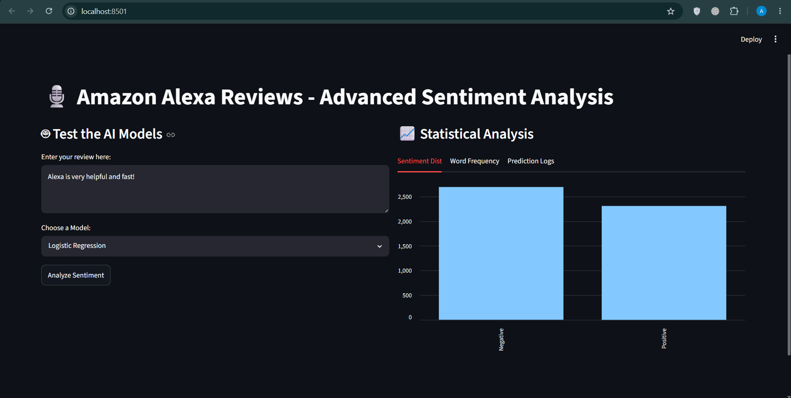
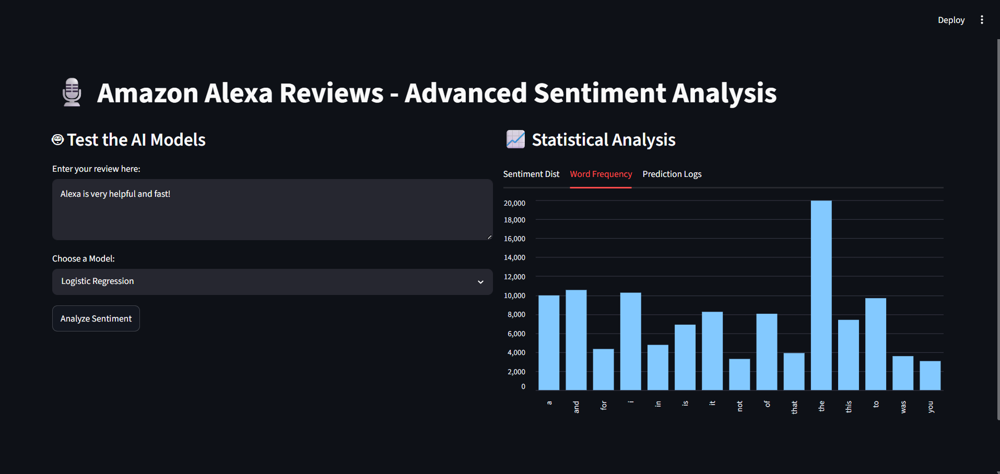
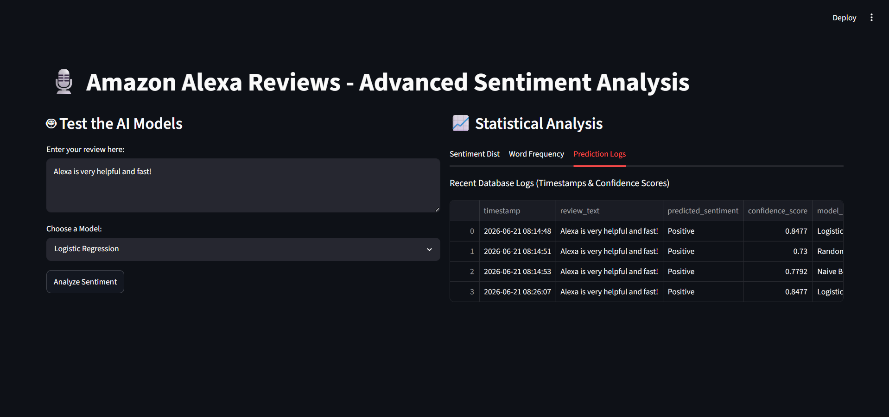
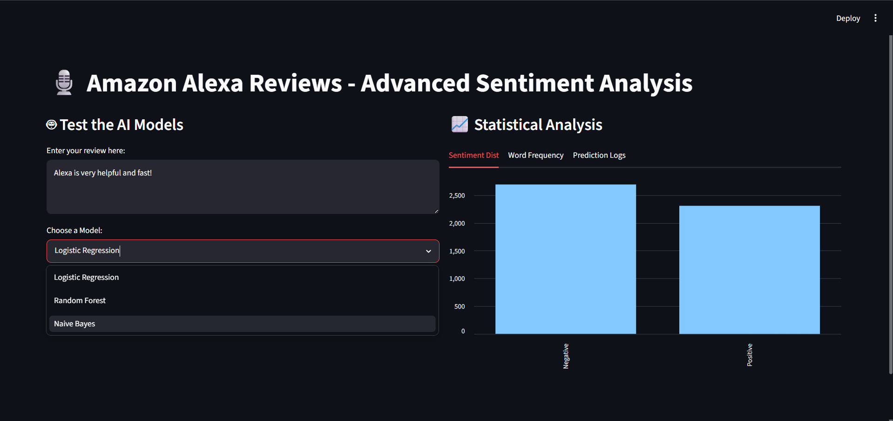
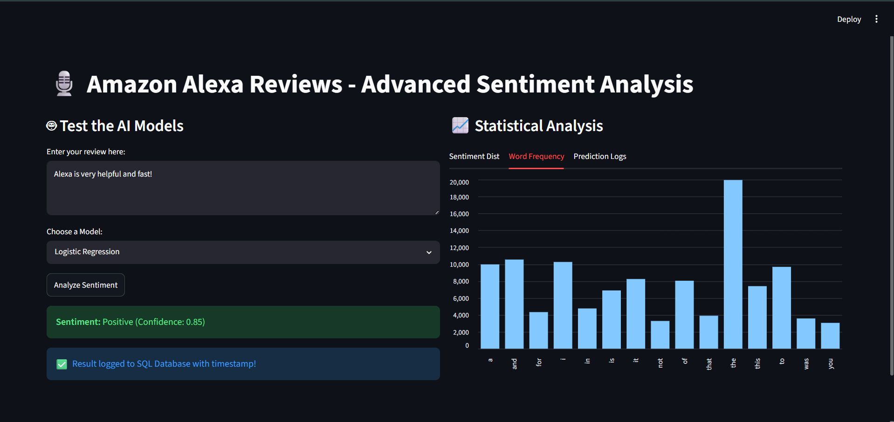

# 🎙️ Amazon Alexa Reviews - End-to-End Sentiment Analysis Dashboard

## 1. System Design (Sistem Tasarımı)
This project is an end-to-end NLP pipeline. It reads raw data, processes text, trains multiple machine learning models, stores predictions in an SQLite database, and serves an interactive web dashboard using Streamlit.

## 2. Dataset Description (Veri Seti Açıklaması)
The dataset used is the **Amazon Alexa Reviews** dataset from Kaggle. It contains real customer reviews and sentiment labels (Positive/Negative). A balanced subset of the data is extracted and converted into a querying format within an SQLite database.

## 3. Model Selection Rationale (Model Seçim Gerekçesi)
To compare different mathematical approaches to text classification, three specific models were chosen:
* **Logistic Regression:** A strong baseline for binary text classification.
* **Naive Bayes:** Highly effective for term frequency (TF-IDF) probabilistic classification.
* **Support Vector Machine (SVM):** Excellent for finding hyperplanes in high-dimensional vector spaces.

## 4. Training Process (Eğitim Süreci)
1. **Text Cleaning:** Removed punctuation and converted to lowercase.
2. **Stopword Removal & Tokenization:** Handled natively via `TfidfVectorizer` (`stop_words='english'`).
3. **Feature Extraction:** Transformed textual data into numerical vectors using **TF-IDF**.
4. **Data Splitting:** 80% Training, 20% Testing.

## 5. Evaluation Results (Değerlendirme Sonuçları)
Models were evaluated using Accuracy, Precision, Recall, F1-Score, and Confusion Matrix metrics via `classification_report`. 
*(Note: Real-time accuracy comparisons are dynamically displayed in the Dashboard's 'Model Comparison' tab).*

## 6. Installation Instructions (Kurulum Talimatları)
1. **Prepare the Data & Database:**
   ```bash
   python prepare_data.py

## 7. Dashboard Screenshots (Gösterge Paneli Ekran Görüntüleri)

### 1. Main Sentiment Analysis Interface (Ana Tahmin Arayüzü)


### 2. Model Comparison - Accuracy Chart (Model Karşılaştırma Grafiği)


### 3. Word Frequency - Top 15 Words (Kelime Frekans Analizi)


### 4. Real-time Prediction Logs (SQL) (Anlık Tahmin Kayıtları)


### 5. System Overview & Tabs (Sistem Genel Görünümü ve Sekmeler)
